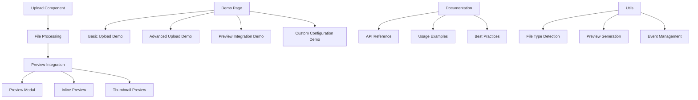
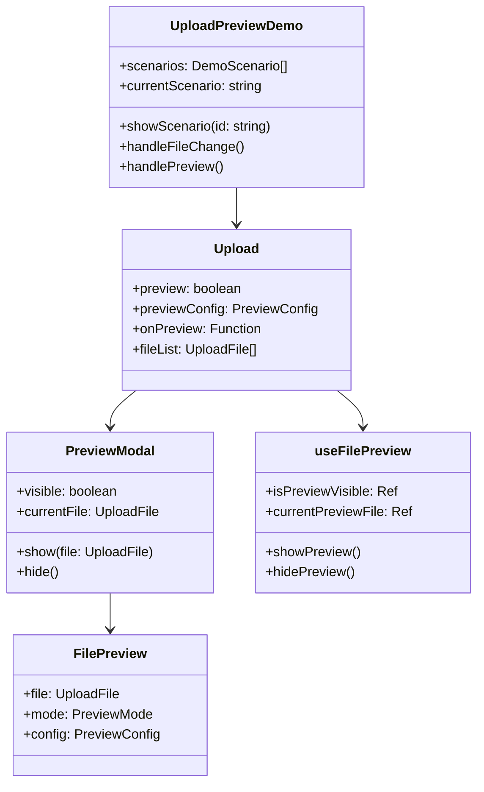

# Design Document

## Overview

本设计文档描述了文件上传和预览功能的完整集成方案。基于现有的Upload组件和Preview组件，我们将创建一个综合的演示系统，展示如何有效地结合使用这些组件，并提供最佳实践指导。

设计的核心目标是：
1. 提供完整的上传预览集成演示
2. 展示不同文件类型的处理方式
3. 优化用户交互体验
4. 提供开发者友好的API和文档

## Architecture

### 整体架构



### 组件关系图



## Components and Interfaces

### 1. UploadPreviewDemo 主演示组件

这是一个新的演示组件，展示各种上传预览集成场景：

```typescript
interface UploadPreviewDemoProps {
  // 演示场景配置
  scenarios?: DemoScenario[]
  // 默认显示的场景
  defaultScenario?: string
  // 是否显示代码示例
  showCode?: boolean
  // 是否显示配置面板
  showConfig?: boolean
}

interface DemoScenario {
  id: string
  title: string
  description: string
  component: Component
  config: UploadPreviewConfig
  code?: string
}

interface UploadPreviewConfig {
  upload: {
    multiple?: boolean
    dragUpload?: boolean
    maxSize?: number
    allowedTypes?: string[]
    maxCount?: number
  }
  preview: {
    enabled?: boolean
    mode?: 'modal' | 'inline' | 'thumbnail'
    imageConfig?: ImagePreviewConfig
    videoConfig?: VideoPreviewConfig
    documentConfig?: DocumentPreviewConfig
  }
  integration: {
    autoPreview?: boolean
    previewOnUpload?: boolean
    thumbnailInList?: boolean
    quickActions?: boolean
  }
}
```

### 2. 增强的Upload组件集成

扩展现有Upload组件的预览集成功能，**隐藏原生文件列表，使用统一的预览集成列表**：

```typescript
interface EnhancedUploadProps extends SimpleUploadProps {
  // 预览集成配置
  previewIntegration?: {
    // 隐藏原生文件列表，使用自定义列表
    hideNativeList?: boolean
    // 上传完成后自动预览
    autoPreview?: boolean
    // 在文件列表中显示缩略图
    showThumbnails?: boolean
    // 快速预览模式（悬停显示）
    quickPreview?: boolean
    // 预览触发方式
    previewTrigger?: 'click' | 'hover' | 'manual'
    // 列表布局模式
    listLayout?: 'list' | 'grid' | 'compact'
  }
  
  // 预览事件增强
  onPreviewStart?: (file: UploadFile) => void
  onPreviewLoaded?: (file: UploadFile) => void
  onPreviewError?: (file: UploadFile, error: Error) => void
  onPreviewClose?: (file: UploadFile) => void
}

### 3. 统一文件列表组件

创建一个统一的文件列表组件，替代Upload组件的原生列表：

```typescript
interface UnifiedFileListProps {
  // 文件列表数据
  files: UploadFile[]
  // 显示模式
  mode: 'list' | 'grid' | 'compact'
  // 是否显示缩略图
  showThumbnails: boolean
  // 预览配置
  previewConfig: PreviewConfig
  // 是否可编辑（删除、重命名等）
  editable: boolean
  // 加载状态
  loading: boolean
}

interface UnifiedFileListEmits {
  // 预览文件
  preview: [file: UploadFile]
  // 删除文件
  remove: [file: UploadFile]
  // 重试上传
  retry: [file: UploadFile]
  // 下载文件
  download: [file: UploadFile]
}

class UnifiedFileList {
  // 渲染文件项
  renderFileItem(file: UploadFile): VNode
  
  // 生成缩略图
  generateThumbnail(file: UploadFile): Promise<string>
  
  // 获取文件图标
  getFileIcon(file: UploadFile): string
  
  // 格式化文件大小
  formatFileSize(size: number): string
  
  // 获取上传进度
  getUploadProgress(file: UploadFile): number
}
```

### 4. 预览集成管理器

创建一个专门的预览集成管理器，协调Upload组件和统一文件列表：

```typescript
class PreviewIntegrationManager {
  private uploadRef: Ref<any>
  private fileListRef: Ref<any>
  private previewModalRef: Ref<any>
  private config: UploadPreviewConfig
  
  constructor(config: UploadPreviewConfig)
  
  // 初始化集成
  initialize(): void
  
  // 处理文件上传完成
  handleUploadComplete(file: UploadFile): void
  
  // 处理预览请求
  handlePreviewRequest(file: UploadFile): void
  
  // 同步文件列表状态
  syncFileListState(files: UploadFile[]): void
  
  // 生成缩略图
  generateThumbnail(file: UploadFile): Promise<string>
  
  // 清理资源
  cleanup(): void
}

### 4. 演示场景组件

为不同的使用场景创建专门的演示组件：

```typescript
// 基础集成场景
interface BasicIntegrationScenario {
  title: "基础上传预览集成"
  features: [
    "文件上传后立即显示预览",
    "支持图片、视频、文档预览",
    "点击预览图标打开模态框"
  ]
}

// 高级集成场景
interface AdvancedIntegrationScenario {
  title: "高级上传预览功能"
  features: [
    "拖拽上传 + 实时预览",
    "批量上传 + 预览切换",
    "自定义预览配置"
  ]
}

// 移动端适配场景
interface MobileIntegrationScenario {
  title: "移动端上传预览"
  features: [
    "触摸友好的预览操作",
    "响应式布局适配",
    "手势缩放和滑动"
  ]
}
```

## Data Models

### 1. 演示数据模型

```typescript
interface DemoData {
  scenarios: DemoScenario[]
  currentScenario: string
  uploadedFiles: UploadFile[]
  previewHistory: PreviewHistoryItem[]
  statistics: UploadPreviewStats
}

interface PreviewHistoryItem {
  file: UploadFile
  previewTime: Date
  previewDuration: number
  actions: PreviewAction[]
}

interface PreviewAction {
  type: 'zoom' | 'rotate' | 'download' | 'fullscreen'
  timestamp: Date
  value?: any
}

interface UploadPreviewStats {
  totalUploads: number
  totalPreviews: number
  previewSuccessRate: number
  averagePreviewTime: number
  popularFileTypes: FileTypeStats[]
}
```

### 2. 配置数据模型

```typescript
interface PreviewIntegrationConfig {
  // 全局配置
  global: {
    theme: 'light' | 'dark'
    language: string
    animations: boolean
  }
  
  // 上传配置
  upload: {
    concurrent: number
    retryCount: number
    chunkSize: number
    autoUpload: boolean
  }
  
  // 预览配置
  preview: {
    lazyLoad: boolean
    cacheSize: number
    preloadNext: boolean
    keyboardShortcuts: boolean
  }
  
  // 集成配置
  integration: {
    autoPreview: boolean
    thumbnailGeneration: boolean
    previewCache: boolean
    eventLogging: boolean
  }
}
```

## Error Handling

### 1. 上传预览错误处理

```typescript
enum UploadPreviewErrorType {
  UPLOAD_FAILED = 'upload_failed',
  PREVIEW_GENERATION_FAILED = 'preview_generation_failed',
  PREVIEW_LOAD_FAILED = 'preview_load_failed',
  UNSUPPORTED_FILE_TYPE = 'unsupported_file_type',
  FILE_TOO_LARGE = 'file_too_large',
  NETWORK_ERROR = 'network_error'
}

interface UploadPreviewError {
  type: UploadPreviewErrorType
  message: string
  file?: UploadFile
  originalError?: Error
  recoverable: boolean
  retryAction?: () => void
}

class UploadPreviewErrorHandler {
  static handle(error: UploadPreviewError): void
  static showUserFriendlyMessage(error: UploadPreviewError): void
  static logError(error: UploadPreviewError): void
  static canRecover(error: UploadPreviewError): boolean
}
```

### 2. 错误恢复策略

```typescript
interface ErrorRecoveryStrategy {
  // 自动重试策略
  autoRetry: {
    enabled: boolean
    maxAttempts: number
    backoffStrategy: 'linear' | 'exponential'
  }
  
  // 降级策略
  fallback: {
    showGenericIcon: boolean
    enableBasicPreview: boolean
    disableAdvancedFeatures: boolean
  }
  
  // 用户反馈
  userFeedback: {
    showErrorDetails: boolean
    provideRetryButton: boolean
    suggestAlternatives: boolean
  }
}
```

## Testing Strategy

### 1. 单元测试

```typescript
describe('UploadPreviewIntegration', () => {
  describe('基础功能测试', () => {
    it('应该在文件上传后自动显示预览')
    it('应该支持不同文件类型的预览')
    it('应该正确处理预览错误')
    it('应该支持预览模态框的打开和关闭')
  })
  
  describe('集成测试', () => {
    it('应该正确集成Upload和Preview组件')
    it('应该支持配置的动态更新')
    it('应该正确处理事件传递')
  })
  
  describe('性能测试', () => {
    it('应该高效处理大量文件的预览')
    it('应该正确管理内存使用')
    it('应该支持懒加载优化')
  })
})
```

### 2. 集成测试

```typescript
describe('演示页面集成测试', () => {
  it('应该正确渲染所有演示场景')
  it('应该支持场景之间的切换')
  it('应该正确显示代码示例')
  it('应该支持配置的实时预览')
})
```

### 3. E2E测试

```typescript
describe('端到端测试', () => {
  it('用户应该能够上传文件并立即预览')
  it('用户应该能够在预览模态框中进行各种操作')
  it('用户应该能够在移动设备上正常使用')
  it('用户应该能够处理网络错误情况')
})
```

## Performance Considerations

### 1. 预览性能优化

- **懒加载**: 只有在需要时才生成和加载预览
- **缓存策略**: 缓存生成的缩略图和预览数据
- **虚拟滚动**: 对于大量文件列表使用虚拟滚动
- **图片压缩**: 自动压缩大尺寸图片的预览

### 2. 内存管理

- **资源清理**: 及时清理不再使用的blob URL和canvas
- **预览限制**: 限制同时预览的文件数量
- **垃圾回收**: 主动触发垃圾回收释放内存

### 3. 网络优化

- **预加载策略**: 智能预加载可能需要预览的文件
- **并发控制**: 限制同时进行的预览请求数量
- **断点续传**: 支持大文件的断点续传

## Accessibility

### 1. 键盘导航

- 支持Tab键在上传区域和预览区域之间导航
- 支持空格键和回车键触发预览
- 支持ESC键关闭预览模态框

### 2. 屏幕阅读器支持

- 为所有交互元素提供适当的aria-label
- 提供文件上传和预览状态的语音反馈
- 支持预览内容的文本描述

### 3. 视觉辅助

- 支持高对比度模式
- 提供足够的颜色对比度
- 支持字体大小调整

## Security Considerations

### 1. 文件安全

- 验证文件类型和大小
- 防止恶意文件上传
- 沙箱化预览环境

### 2. 数据安全

- 安全的文件URL生成
- 防止XSS攻击
- 敏感信息过滤

### 3. 隐私保护

- 本地预览优先
- 最小化数据传输
- 用户数据加密存储