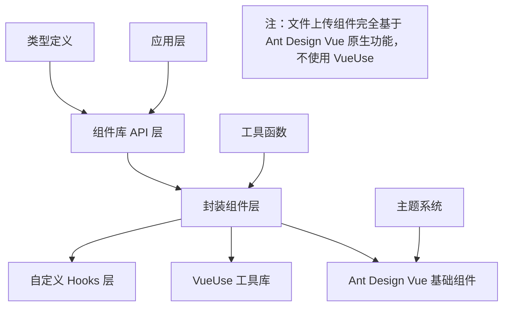
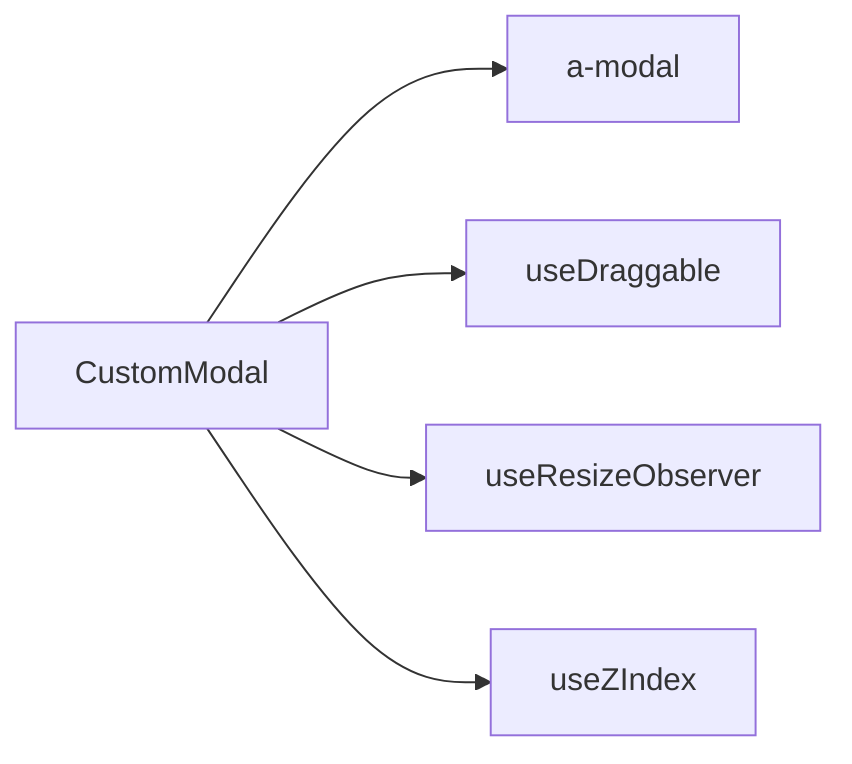
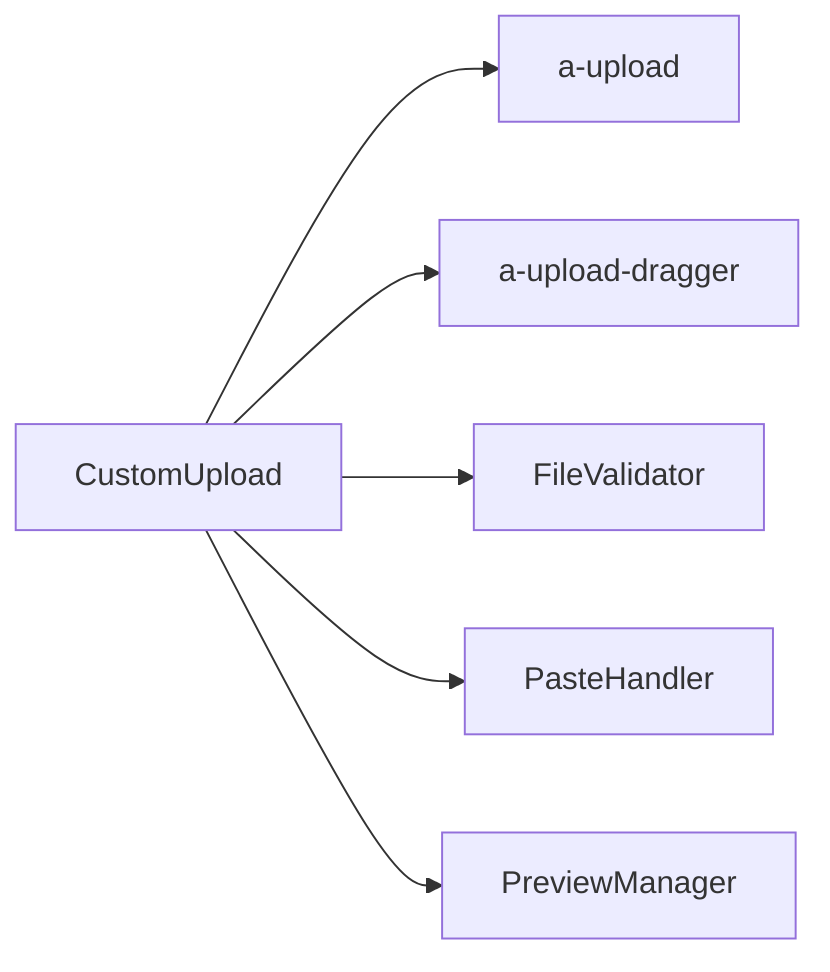
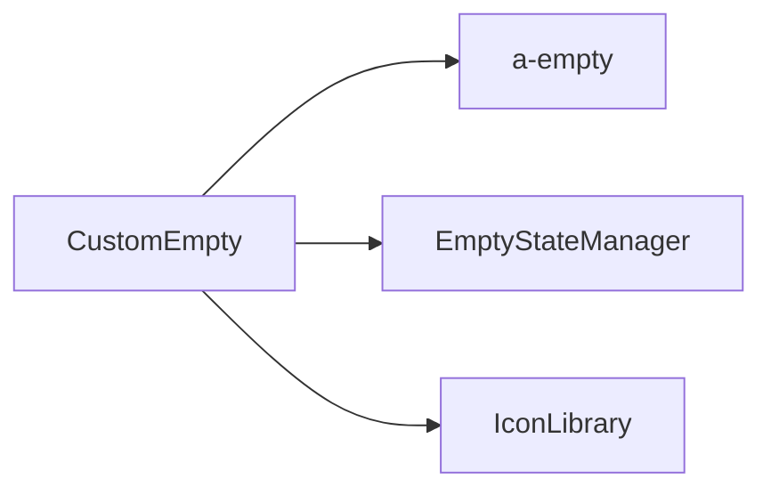
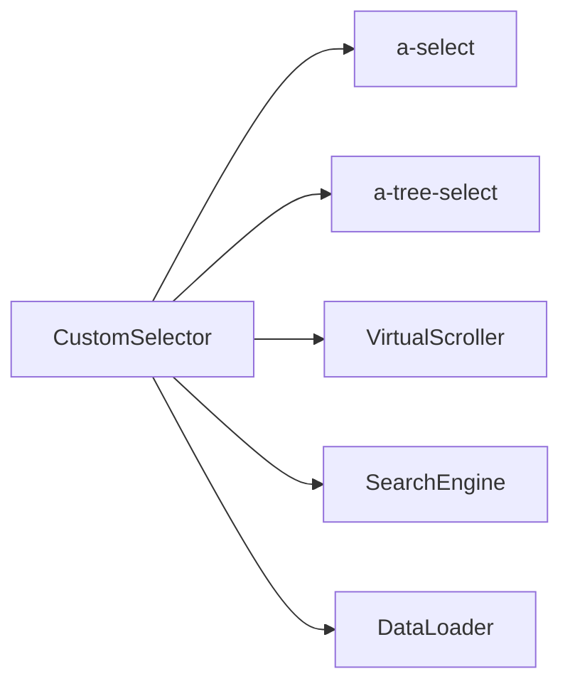
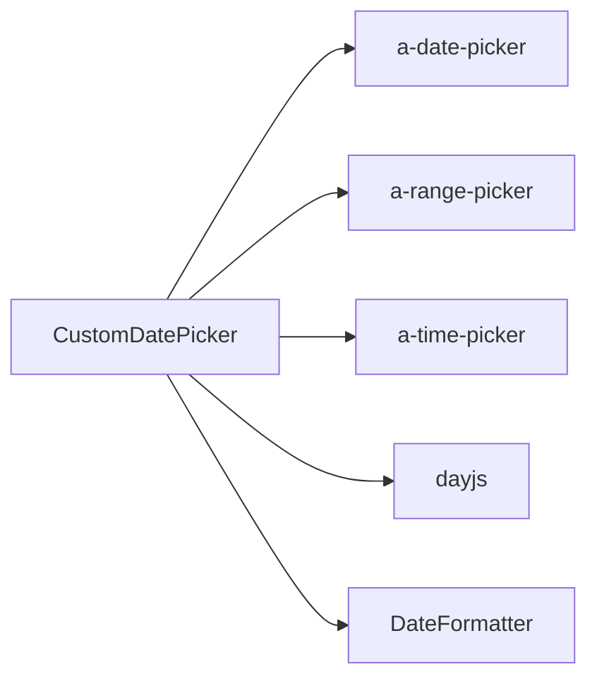
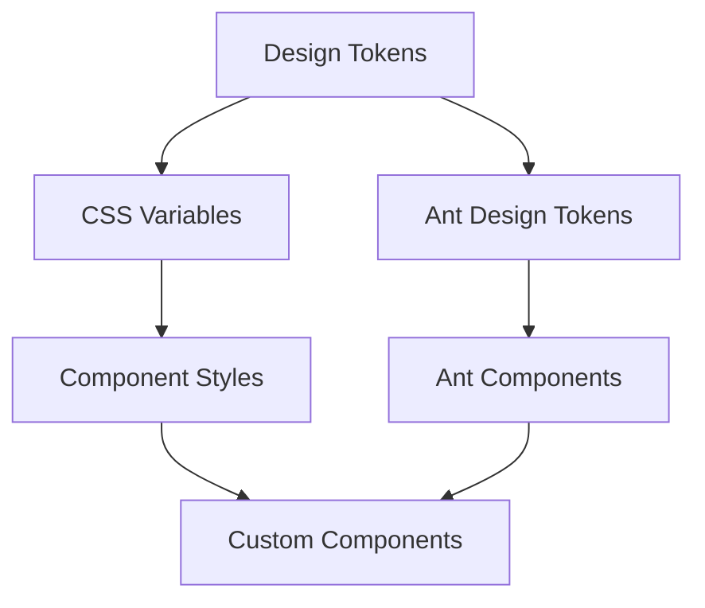

# Vue 组件库设计文档

## 概述

本设计文档基于 Vue 组件库需求文档，详细描述了基于 Ant Design Vue 封装的 17 个核心组件的技术架构、实现方案和设计决策。该组件库严格遵循"封装增强而非替代"的原则，确保与 Ant Design Vue 生态系统的完全兼容性。

## 架构设计

### 整体架构



### 核心设计原则

1. **透明封装原则**
   - 所有 Ant Design Vue 原生 API 完全透传
   - 封装层对用户透明，不增加使用复杂度
   - 保持与原生组件 100% 兼容性

2. **渐进增强原则**
   - 基础功能依赖 Ant Design Vue
   - 增强功能通过 VueUse 和自定义逻辑实现（文件上传组件例外）
   - 文件上传组件完全基于 Ant Design Vue 原生功能实现
   - 所有增强功能都是可选的

3. **类型安全原则**
   - 完整的 TypeScript 类型支持
   - 继承并扩展原生组件类型
   - 编译时类型检查确保 API 兼容性

## 组件架构

### 通用组件封装模式

每个组件都遵循统一的封装模式：

```typescript
// 通用封装模式
interface BaseWrapperProps<T = any> extends T {
  // 扩展属性
}

interface BaseWrapperEmits<T = any> extends T {
  // 扩展事件
}

interface BaseWrapperSlots<T = any> extends T {
  // 扩展插槽
}

interface BaseWrapperExpose {
  // 原生组件实例引用
  nativeInstance: ComponentPublicInstance;
  // 扩展方法
}
```

### 组件分层架构

1. **表现层 (Presentation Layer)**
   - 负责组件的渲染和用户交互
   - 处理 props、events、slots 的透传
   - 管理组件的生命周期

2. **逻辑层 (Logic Layer)**
   - 封装组件的业务逻辑
   - 集成 VueUse 工具库功能
   - 处理数据转换和状态管理

3. **适配层 (Adapter Layer)**
   - 适配 Ant Design Vue 组件 API
   - 处理属性映射和事件转换
   - 确保类型兼容性

## 核心组件设计

### 1. 弹窗组件 (Modal)

#### 技术架构


#### 核心设计决策

**尺寸管理系统**
- 预设尺寸：small(400px), normal(520px), large(800px), fullscreen
- 响应式尺寸适配，移动端自动调整
- 支持自定义尺寸和最小/最大尺寸限制

**拖拽系统设计**
- 基于 VueUse `useDraggable` 实现
- 拖拽句柄：标题栏区域
- 边界检测：防止拖拽超出视口
- 性能优化：使用 `transform` 而非 `position` 属性

**调整尺寸系统**
- 基于 VueUse `useResizeObserver` 监听尺寸变化
- 8个调整点：四角 + 四边
- 最小尺寸限制：300x200px
- 纵横比锁定选项

#### 接口设计

```typescript
interface CustomModalProps extends ModalProps {
  size?: 'small' | 'normal' | 'large' | 'fullscreen' | number;
  draggable?: boolean;
  resizable?: boolean;
  minWidth?: number;
  minHeight?: number;
  maxWidth?: number;
  maxHeight?: number;
  keepRatio?: boolean;
}

interface CustomModalEmits extends ModalEmits {
  'resize': (size: { width: number; height: number }) => void;
  'drag': (position: { x: number; y: number }) => void;
}
```

### 2. 文件上传组件 (Upload)

#### 技术架构


#### 核心设计决策

**基于 Ant Design Vue 原生功能**
- 完全基于 `a-upload` 组件实现所有上传功能
- 使用 `a-upload-dragger` 实现拖拽上传
- 利用 `a-upload` 的文件列表管理和状态控制
- 保持与 Ant Design Vue 主题系统的完全兼容

**文件验证系统**
- 类型验证：基于 MIME 类型和文件扩展名
- 大小验证：支持 MB/KB 单位，批量文件总大小限制
- 数量验证：单次上传和总文件数量限制
- 自定义验证：支持用户自定义验证函数
- 集成 `a-upload` 的 `beforeUpload` 钩子

**拖拽上传设计**
- 基于 `a-upload-dragger` 组件实现
- 支持拖拽区域自定义样式
- 拖拽状态视觉反馈
- 多文件拖拽支持

**粘贴上传设计**
- 监听全局 paste 事件
- 从剪贴板提取图片文件
- 转换为 File 对象并添加到上传队列
- 与 `a-upload` 的文件列表系统集成

**预览系统设计**
- 图片预览：基于 `a-image` 组件实现缩略图和全屏预览
- 文档预览：支持 PDF、Office 文档在线预览
- 视频预览：支持视频封面和播放控制
- 预览组件懒加载，优化性能

**上传状态管理**
- 基于 `a-upload` 的原生状态管理
- 进度追踪：利用 `a-upload` 的进度显示
- 错误处理：网络错误、服务器错误分类处理
- 重试机制：失败文件自动/手动重试

#### 接口设计

```typescript
interface FileValidationRule {
  types?: string[];
  maxSize?: number;
  maxCount?: number;
  validator?: (file: File) => boolean | Promise<boolean>;
}

interface CustomUploadProps extends UploadProps {
  validation?: FileValidationRule;
  preview?: boolean;
  pasteUpload?: boolean;
  dragUpload?: boolean;
  retryCount?: number;
}

interface CustomUploadEmits extends UploadEmits {
  'paste': (files: File[]) => void;
  'validation-error': (error: ValidationError) => void;
}
```

### 3. 空状态组件 (Empty)

#### 技术架构


#### 核心设计决策

**状态类型系统**
- 预设状态：无数据、网络错误、权限不足、搜索无结果
- 每种状态包含：图标、标题、描述、操作按钮
- 支持自定义状态和国际化

**视觉设计系统**
- 图标库：内置常用状态图标，支持自定义图标
- 布局系统：垂直居中、响应式适配
- 主题适配：自动适配亮色/暗色主题

#### 接口设计

```typescript
type EmptyStateType = 'no-data' | 'network-error' | 'no-permission' | 'no-search-result';

interface CustomEmptyProps extends EmptyProps {
  type?: EmptyStateType;
  title?: string;
  description?: string;
  actionText?: string;
  onAction?: () => void;
}
```

### 4. 选择器组件 (Selector)

#### 技术架构


#### 核心设计决策

**模式切换系统**
- 普通选择模式：基于 `a-select`
- 树形选择模式：基于 `a-tree-select`
- 运行时模式切换，保持状态一致性

**虚拟滚动优化**
- 大数据集优化：>100 项启用虚拟滚动
- 动态高度支持：适配不同选项高度
- 搜索结果虚拟化：保持搜索性能

**搜索引擎设计**
- 本地搜索：支持拼音、模糊匹配
- 远程搜索：防抖、缓存、加载状态
- 高亮显示：搜索关键词高亮
- 搜索历史：记录用户搜索历史

#### 接口设计

```typescript
interface SelectorMode {
  type: 'select' | 'tree-select';
  multiple?: boolean;
  searchable?: boolean;
  virtual?: boolean;
}

interface CustomSelectorProps {
  mode: SelectorMode;
  dataSource: any[] | (() => Promise<any[]>);
  searchConfig?: SearchConfig;
  virtualConfig?: VirtualConfig;
}
```

### 5. 日期选择器组件 (DatePicker)

#### 技术架构


#### 核心设计决策

**统一日期处理**
- 基于 dayjs 的日期处理系统
- 时区处理：支持多时区转换
- 格式化系统：输入格式与显示格式分离
- 国际化：支持多语言日期格式

**选择模式设计**
- 单日期、日期范围、多日期选择
- 时间选择：日期时间、时间段
- 周期选择：周、月、季度、年
- 快捷选择：今天、昨天、本周、本月等

#### 接口设计

```typescript
interface DatePickerMode {
  type: 'date' | 'datetime' | 'time' | 'range' | 'multiple';
  precision?: 'date' | 'hour' | 'minute' | 'second';
}

interface CustomDatePickerProps {
  mode: DatePickerMode;
  format?: string;
  displayFormat?: string;
  timezone?: string;
  shortcuts?: ShortcutConfig[];
}
```

## 数据模型

### 组件配置模型

```typescript
interface ComponentConfig {
  // 基础配置
  name: string;
  version: string;
  antdComponent: string | string[];
  
  // 功能配置
  features: {
    draggable?: boolean;
    resizable?: boolean;
    virtual?: boolean;
    search?: boolean;
  };
  
  // 性能配置
  performance: {
    lazy?: boolean;
    virtual?: boolean;
    debounce?: number;
  };
  
  // 主题配置
  theme: {
    customizable: boolean;
    tokens?: string[];
  };
}
```

### 事件系统模型

```typescript
interface EventSystem {
  // 原生事件透传
  nativeEvents: Record<string, Function>;
  
  // 自定义事件
  customEvents: {
    name: string;
    payload: any;
    handler: Function;
  }[];
  
  // 事件拦截器
  interceptors: {
    before?: (event: Event) => boolean;
    after?: (event: Event) => void;
  };
}
```

## 错误处理

### 错误分类系统

1. **组件封装错误**
   - 属性类型错误
   - 事件处理错误
   - 生命周期错误

2. **依赖库错误**
   - Ant Design Vue 版本不兼容
   - VueUse 功能不可用（文件上传组件不受影响）
   - 第三方库加载失败

3. **用户使用错误**
   - 无效的属性值
   - 缺少必需的依赖
   - 不正确的使用方式

### 错误处理策略

```typescript
interface ErrorHandler {
  // 错误捕获
  capture: (error: Error, context: ComponentContext) => void;
  
  // 错误恢复
  recover: (error: Error) => boolean;
  
  // 错误报告
  report: (error: Error, level: 'warn' | 'error') => void;
  
  // 降级处理
  fallback: (component: string) => ComponentOptions;
}
```

## 测试策略

### 测试分层

1. **单元测试**
   - 组件属性测试
   - 事件触发测试
   - 方法调用测试
   - 类型检查测试

2. **集成测试**
   - 与 Ant Design Vue 集成测试
   - 主题系统集成测试
   - VueUse 功能集成测试

3. **端到端测试**
   - 用户交互流程测试
   - 性能基准测试
   - 兼容性测试

### 测试工具链

```typescript
interface TestingStack {
  unitTest: 'vitest';
  componentTest: '@vue/test-utils';
  e2eTest: 'playwright';
  visualTest: 'chromatic';
  performanceTest: 'lighthouse';
}
```

## 性能优化

### 打包优化

1. **Tree Shaking**
   - 组件级别的按需引入
   - 工具函数的独立导出
   - 样式文件的按需加载

2. **代码分割**
   - 组件懒加载
   - 路由级别分割
   - 第三方库分离

3. **压缩优化**
   - JavaScript 压缩
   - CSS 压缩
   - 图片资源优化

### 运行时优化

1. **虚拟化**
   - 大列表虚拟滚动
   - 树形结构虚拟化
   - 表格数据虚拟化

2. **缓存策略**
   - 组件实例缓存
   - 计算结果缓存
   - 网络请求缓存

3. **防抖节流**
   - 搜索输入防抖
   - 滚动事件节流
   - 窗口调整节流

## 主题系统

### 主题架构



### 主题定制

1. **Token 系统**
   - 继承 Ant Design Vue Design Tokens
   - 扩展自定义 Tokens
   - 支持动态主题切换

2. **样式隔离**
   - CSS Modules 支持
   - Scoped CSS 支持
   - CSS-in-JS 支持

3. **主题预设**
   - 亮色主题
   - 暗色主题
   - 高对比度主题
   - 自定义主题

## 国际化

### 多语言支持

1. **文本国际化**
   - 组件内置文本
   - 错误信息文本
   - 帮助提示文本

2. **格式国际化**
   - 日期格式
   - 数字格式
   - 货币格式

3. **布局适配**
   - RTL 布局支持
   - 字体适配
   - 间距调整

## 文档系统

### 文档架构

1. **API 文档**
   - 自动生成的 API 文档
   - TypeScript 类型文档
   - 示例代码文档

2. **使用指南**
   - 快速开始指南
   - 最佳实践指南
   - 迁移指南

3. **设计规范**
   - 组件设计规范
   - 交互设计规范
   - 视觉设计规范

### 文档工具

```typescript
interface DocumentationTools {
  generator: 'typedoc' | 'vitepress';
  playground: 'storybook';
  examples: 'vue-playground';
  api: 'auto-generated';
}
```

## 部署与发布

### 发布策略

1. **版本管理**
   - 语义化版本控制
   - 变更日志自动生成
   - 向后兼容性保证

2. **发布渠道**
   - NPM 包发布
   - CDN 资源发布
   - 文档站点发布

3. **质量保证**
   - 自动化测试
   - 代码质量检查
   - 性能基准测试

### CI/CD 流程


## 总结

本设计文档详细描述了基于 Ant Design Vue 的组件库架构设计，确保了：

1. **完全兼容性** - 与 Ant Design Vue 生态系统无缝集成
2. **渐进增强** - 在保持原生功能的基础上提供增强功能
3. **类型安全** - 完整的 TypeScript 类型支持
4. **性能优化** - 针对大数据和复杂交互的性能优化
5. **可维护性** - 清晰的架构分层和代码组织
6. **可扩展性** - 支持未来功能扩展和定制需求

该设计为后续的实现阶段提供了清晰的技术路线图和实现指导。